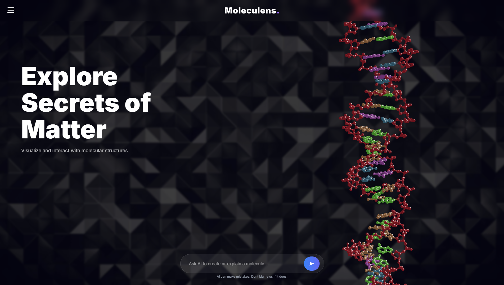
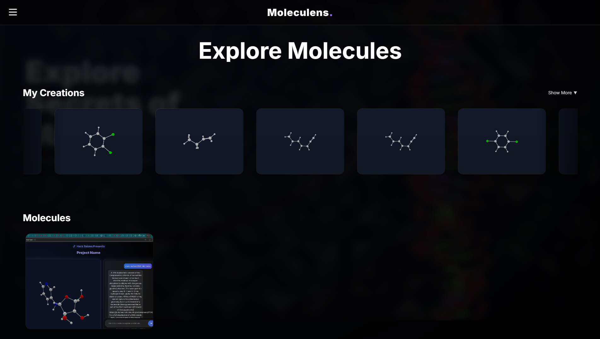
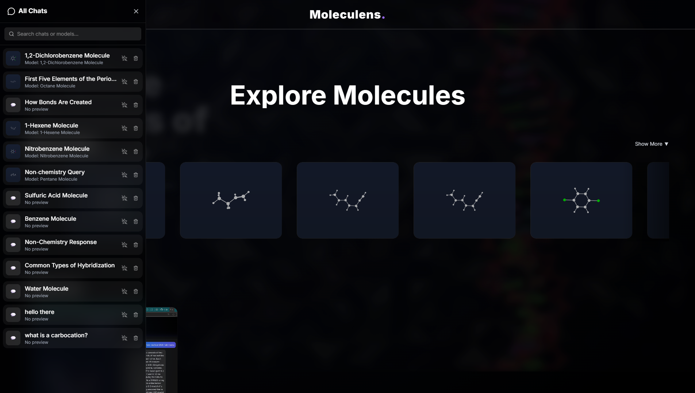
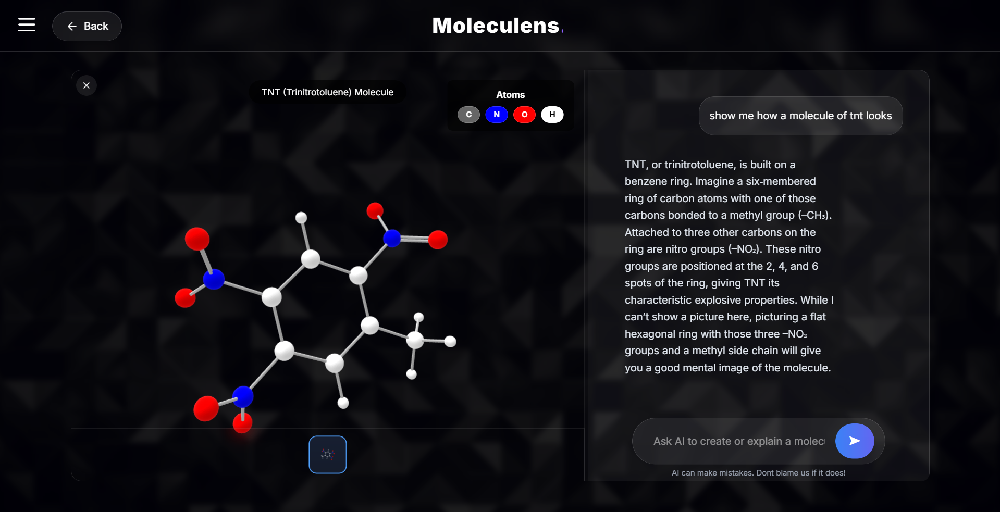
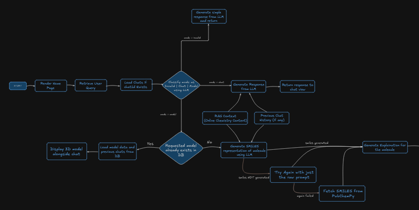
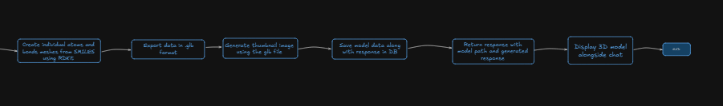

# 🧬 **MolecuLens — AI-Powered Molecular Visualization & Chemistry Assistant**

_A next-generation platform for interactive 3D molecular generation, visualization, and explanation — built with AI, React, Django, and Three.js._

---

## 📖 **Table of Contents**

1. [Overview](#-overview)
2. [Key Features](#-key-features)
3. [Prerequisites](#-prerequisites)
4. [Usage](#-usage)
5. [Project Structure](#-project-structure)
6. [Screenshots](#-screenshots)
7. [Tech Stack](#-tech-stack)
8. [System Architecture](#-system-architecture)
9. [Setup Guide](#-setup-guide)
10. [Acknowledgements](#-acknowledgements)

---

# 🧭 Overview

# Moleculens — AI‑Powered Molecular Visualization & Reaction Animator

Moleculens is an end‑to‑end chemistry platform that allows users to:

- Generate 3D molecular structures (GLB) using natural‑language prompts
- Visualize models interactively in a high‑fidelity Three.js viewer
- Automatically generate atom‑level metadata for color legends
- Maintain multi‑message chat sessions with persistent history
- Explore a library of prebuilt molecules with thumbnails
- View a cinematic 3D landing page with scroll‑triggered diagonal‑wipe transition

---

## 🌐 Key Features

### ✔ Hero Landing Section

🧠 AI-powered molecule generation from text prompts

🧬 3D molecule viewer using Three.js + GLTF

💬 Chat system with saved sessions

📁 Automatic GLB model generation + thumbnails

🌐 Full-stack setup using Django REST API + React frontend

🎨 Modern UI with glass morphism, and dynamic layout switching

📚 Session persistence, pinning, and deletion

🖥️ Split-pane model + chat mode

---

## 🧱 Prerequisites

Before installing, ensure you have:

**Backend**

- Python 3.10+
- pip
- Conda (recommended for RDKit)
- RDKit (`conda install -c conda-forge rdkit`)

**Frontend**

- Node.js 16+
- npm or yarn

---

## 🚀 Usage

**Home Page**

- Scroll through molecule templates
- Click a molecule card to load its 3D model
- Or type a prompt:
  **_“Generate ethanol molecule”_**

**3D Viewer**

- Rotate by dragging
- Zoom using mouse wheel
- Atom list appears on top right
- Idle animation rotates molecule automatically

**Chat Mode**

- AI answers chemistry questions
- Every model generated appears as a thumbnail at bottom
- Sidebar stores all chats
- You can pin, reopen, or delete sessions

**Sidebar**

- List of all sessions
- Search bar
- Pin/unpin
- Slick glass-morphism design

---

## 🏗 Project Structure

---

### Frontend (React + Three.js)

```
src/
 ├─ components/
 │   ├─ Landing3D.jsx
 │   ├─ DNAModel.jsx
 │   ├─ LockedControls.jsx
 │   ├─ ThreeViewer.jsx
 │   ├─ ChatBox.jsx
 │   ├─ Sidebar.jsx
 │   ├─ HomeGrid.jsx
 │   ├─ MoleculeCard.jsx
 │   ├─ Header.jsx
 │   ├─ BackButton.jsx
 │   ├─ InputBar.jsx
 │   └─ LoadingIndicator.jsx
 │
 ├─ App.jsx
 ├─ App.css
 └─ assets/
```

---

### Backend (Django + DRF + Custom Model‑Gen Engine)

```
backend/
 ├─ api/
 │   ├─ generate-model/        → Generate GLB + thumbnail + metadata
 │   ├─ chats/                 → Fetch user chat sessions
 │   ├─ chat/<id>/             → Retrieve a full chat (messages + models)
 │   ├─ chat/<id>/delete/      → Delete a session
 │   ├─ model-chat/            → Lookup chat by molecule name
 │   └─ templates/             → Prebuilt molecules
 │
 ├─ storage/
 │   ├─ glb/
 │   ├─ thumbnails/
 │   └─ sessions/
 │
 ├─ tools/
 │   ├─ ModelGenerator.py      → SMILES → 3D GLB
 │   ├─ ThumbnailBuilder.py    → Renders GLB to PNG
 │   └─ AtomExtractor.py       → Outputs element‑color metadata
 │
 └─ manage.py
```

---

## 📷 Screenshot






---

## 🛠️ Tech Stack

Backend

- Django / Django REST Framework
- RDKit (molecule generation)
- Python 3.10+
- Frontend
- React + Vite
- TailwindCSS
- Three.js
- Framer Motion
- GLTFLoader / OrbitControls

---

## 🧩 System Architecture




---

## 🚀 Setup Guide

### ✅ Step 1 — Clone the Repository

```bash
git clone https://github.com/AbhinavDShetty/Hack-Babies-2.0.git
cd Hack-Babies-2.0
```

### 🐍 2. Backend Setup (Django + RDKit)

#### ▶️ Step 2.1 — Create a Virtual Environment

```bash
cd backend
python -m venv venv
```

Activate it

**Windows:**

```bash
venv\Scripts\activate
```

**Mac/Linux:**

```bash
source venv/bin/activate
```

#### ▶️ Step 2.2 — Install Dependencies

```bash
pip install -r requirements.txt
```

#### ▶️ Step 2.3 — Run Migrations

```bash
python manage.py migrate
```

#### ▶️ Step 2.4 — Run Backend Server

```bash
python manage.py runserver
```

If successful, the backend should run at:

👉 http://127.0.0.1:8000/

### ⚛️ 3. Frontend Setup (React + Vite)

#### ▶️ Step 3.1 — Install Node Module

```bash
cd frontend
npm install
```

#### ▶️ Step 3.2 — Run the Frontend

```bash
npm run dev
```

Your frontend will run at:

👉 http://localhost:5173/

### 🔗 4. Connecting Frontend & Backend

Ensure your frontend API base is set correctly:

Inside App.jsx:

```bash
const API_BASE = "http://127.0.0.1:8000";
```

Backend CORS should allow frontend:

```bash
CORS_ALLOW_ALL_ORIGINS = True
```

### 🧪 5. Using the Application

#### 🎯 Home Page

- Scroll through molecule presets
- Click a molecule card to view its 3D model
- Or use the input bar to ask for any molecule ("generate methane", "show aspirin", etc.)

#### 🧬 3D Model Mode

- Drag to rotate
- Scroll to zoom
- Smooth idle animations
- Atom list displays colors + symbols
- Load previous generated models from the thumbnails bar

#### 🗨️ Chat Mode

- Ask chemistry questions
- Models and explanations are automatically saved
- Sessions appear in the sidebar
- You can pin, delete, or reopen chats

#### 📁 Saved Models

- Every generated molecule is saved as:
  - .glb model
  - Thumbnail
  - Chat session
- Re-open instantly anytime

### 🧹 6. Resetting the Project

To wipe previous models & chats:

**Remove Django migrations & DB**

```bash
rm backend/db.sqlite3
```

**Delete media folder**

```bash
rm -rf backend/media
```

**Recreate DB**

```bash
python manage.py migrate
```

---

## 🙏 Acknowledgements

Special thanks to:

- RDKit Team — for molecular generation tools
- Three.js Community — for 3D rendering libraries
- React + Vite — for a fast frontend
- OpenAI / LLM frameworks — for powering the chemistry explanations

---

## 🎉 You're Ready!

You have fully configured Moleculens.
Start generating molecules, exploring structures, and chatting with AI chemistry.

---

## 👥 Contributors

| Name | Role |
|-------|-------|
| **Chinmay P Kulkarni** | Project Lead |
| **Abhinav D Shetty** | Full-stack Developer |
| **Hasnain Khan** | Frontend & UI/UX |
| **Prakyath Suvarnna** | Backend Integrations & Testing |

> Built collaboratively during the Internal Hackathon 2025, securing **3rd Place 🥉** at <HACKLOOP S04 (at NMAMIT)>.

